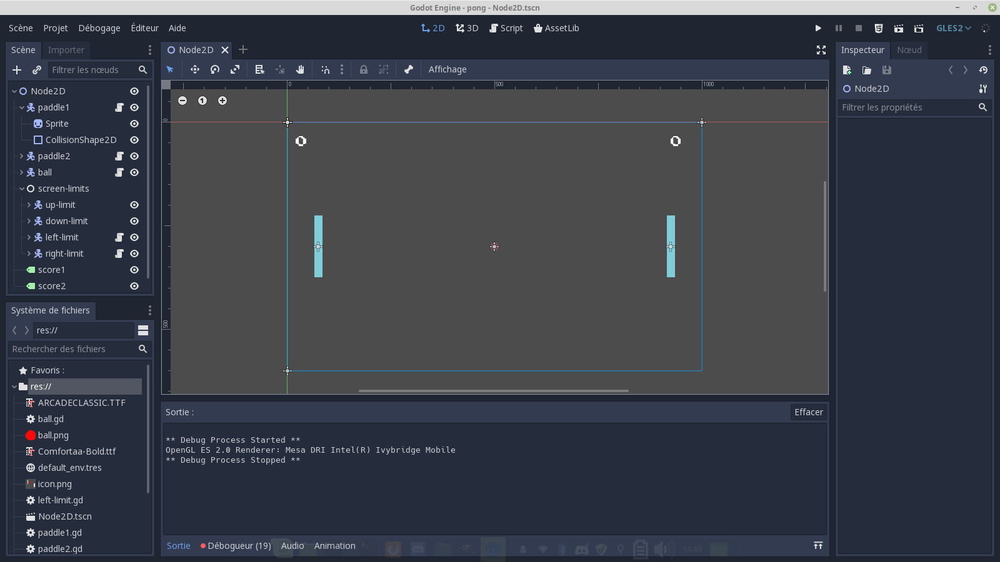
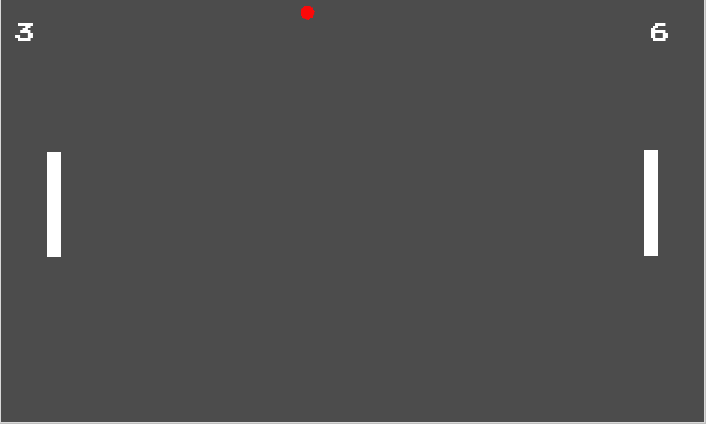

# pong-godot
Voici un exemple simple de ce que l'on peut faire avec le moteur de jeu Godot : un pong conte une petite *IA*.

Pour y jouer il faut tout d'abord [télécharger Godot](https://godotengine.org/download/). Ensuite on extrait tous les fichiers de ce repo dans un dossier vide (par exemple sur votre bureau). Puis on lance Godot, on clique sur `Scanner` et on indique le répertoire en question. On n'a plus qu'à double-cliquer sur `Pong` et on peut modifier le jeu et y jouer.

Voilà à quoi ressemble l'interface :

Et voici le jeu en action :

N'hésitez pas à tester, Godot est un moteur de jeu gratuit et open-source qui ressemble à Unity mais en beaucoup plus simple à utiliser (et presque aussi puissant !). L'environnement de développement ne fait que quelques Mo et vous pouvez faire de la 2D, de la 3D, des collisions, des particules et exporter votre jeu sur Android, iOS, Windows, Linux, Mac ou en HTML5 pour le mettre sur un site ! Le langage de programmation par défaut est le *GDScript* dont la syntaxe ressemble au Python alors lancez-vous !

P. S. : ce repo n'est pas sponsorisé par Godot.
